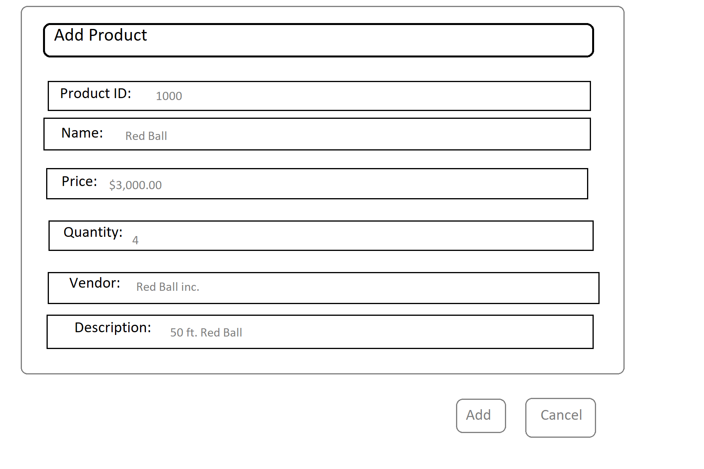
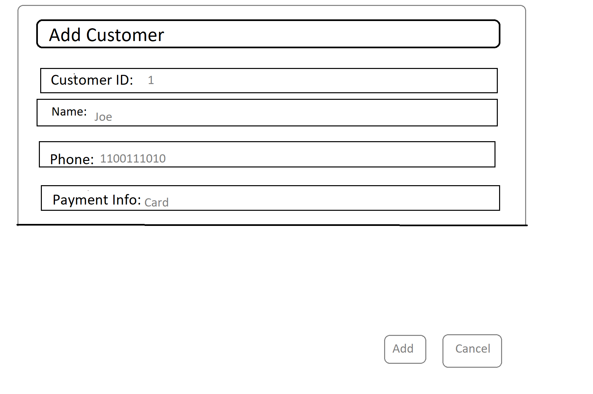

Assignment 3
-------------------------------------------  
#### Alex Lewin

Steps:  

1. User Stories:
  * User wants to add product: User clicks add product, user fills in information, user clicks 'OK'
  * User wants to add customer: User clicks add customer, user fills in information, user clicks 'OK'
  * User wants to record purchase: User clicks add purchase, user fills in information, user clicks 'OK'


2. Write Use Cases:  

|**Actor**|**System Response**|
|----------|-------------------|
|1. Choose 'Add Product'   |2. System redirects to 'Add Product Screen' |
|3. Fills in data and clicks add |4. Display 'Added Product' screen |
|5. Click 'OK' Button |6. Display 'Main'  |


Add Customer:  

|**Actor**|**System Response**|
|----------|-------------------|
|1. Choose 'Add Customer'   |2. System redirects to 'Add Customer Screen' |
|3. Fills in data and clicks add |4. Display 'Added Customer' screen |
|5. Click 'OK' Button |6. Display 'Main'  |

Add Purchase:  

|**Actor**|**System Response**|
|----------|-------------------|
|1. Choose 'Add Purchase'   |2. System redirects to 'Add Purchase Screen' |
|3. Fills in data and clicks add |4. Display 'Added Purchase' screen |
|5. Click 'OK' Button |6. Display 'Main'  |

3.  
* Products(**productid**, barcode, name, expirationdate, price, tax rate, quantity, supplier, manufactured date)  
* Customers(**customerid**, name, phone, paymentinfo)  
* Purchase(**purchaseid**, *customerid*,*productid*, time, quantity, price, tax, cost)  

4. SQL Tables:  

```sql
CREATE TABLE Products(
productid int not null primary key,
barcode int,
name varchar(100),
expirationdate varchar(100),
price float,
tax float,
quantity int,
supplier varchar(100),
manufacturedate varchar(100)
);

CREATE TABLE Customer(
customerid int not null primary key,
name varchar(100),
phone int,
paymentinfo varchar(100)
);

CREATE TABLE Purchase(
purchaseid int not null primary key,
customerid int,
productid int, 
time varchar(100),
quantity int,
price float,
tax float,
cost float
);
```

5. SQL Insertions

```sql
INSERT INTO Products(productid, barcode, name, expirationdate, 
price, tax, quantity, supplier, manufacturedate)
VALUES
(1,10101,"Brick","9/9/99",100.00,0.1,1,"brick co","8/9/93")
(2,10102,"Wood","9/9/99",200.00,0.1,1,"wood co","8/9/93")
(3,10103,"Metal","9/9/99",300.00,0.1,1,"Metal co","8/9/93")
(4,10104,"Glass","9/9/99",10.00,0.1,1,"Glass co","8/9/93")
(5,10105,"Rubber","9/9/99",1000.00,0.1,1,"Rubber co","8/9/93")

INSERT INTO Customer(customerid, name, phone, paymentinfo)
VALUES
(1,"Joe",1011011100,"card")
(2,"Bill",1001101100,"cash")
(3,"Fred",1001101111,"cash")
(4,"Bob",1001100000,"card")
(5,"Phil",1111100000,"card")

INSERT INTO Purchase(purchaseid, customerid, productid, time, quantity, price, tax, cost)
VALUES
(1,1,5,"3:00",1,1000.00,0.1,1100.0)
(2,1,1,"5:00",1,100.00,0.1,110.0)
(3,1,2,"8:00",1,200.00,0.1,220.0)
(4,1,5,"2:00",1,1000.00,0.1,1100.0)
(5,1,5,"2:00",1,1000.00,0.1,1100.0)
(6,2,5,"3:00",1,1000.00,0.1,1100.0)
(7,3,1,"5:00"1,100.00,0.1,110.0)
(8,5,1,"8:00",1,100.00,0.1,110.0)
(9,5,1,"2:00",1,100.00,0.1,110.0)
(10,5,5,"1:00",1,1000.00,0.1,1100.0)
``` 

