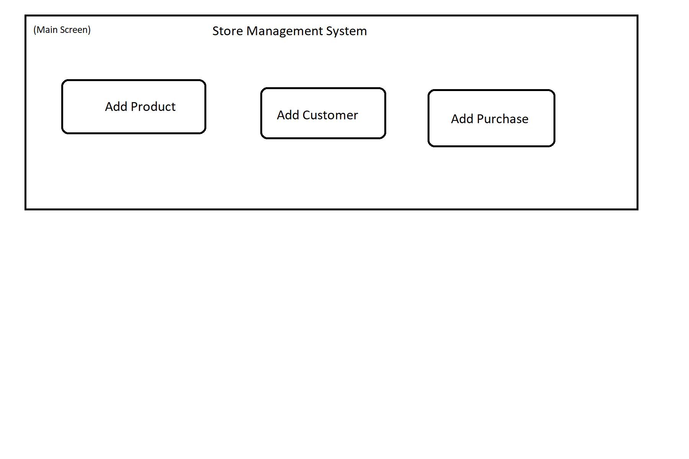
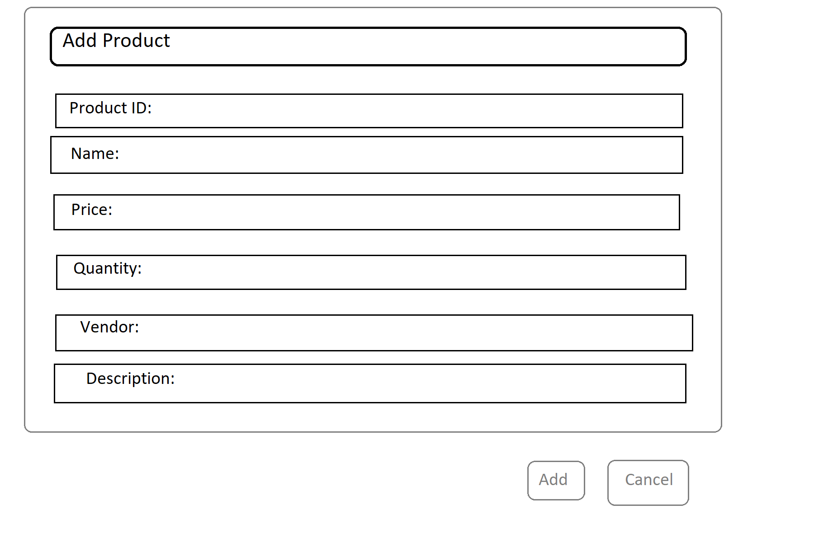
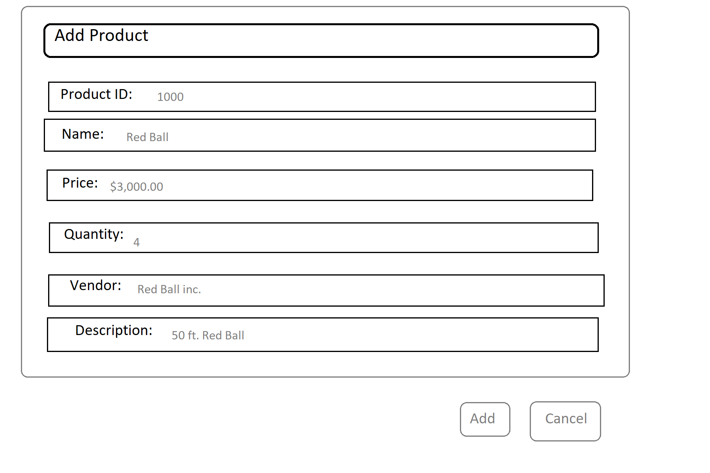
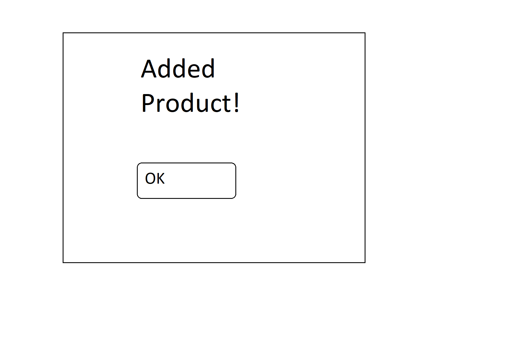
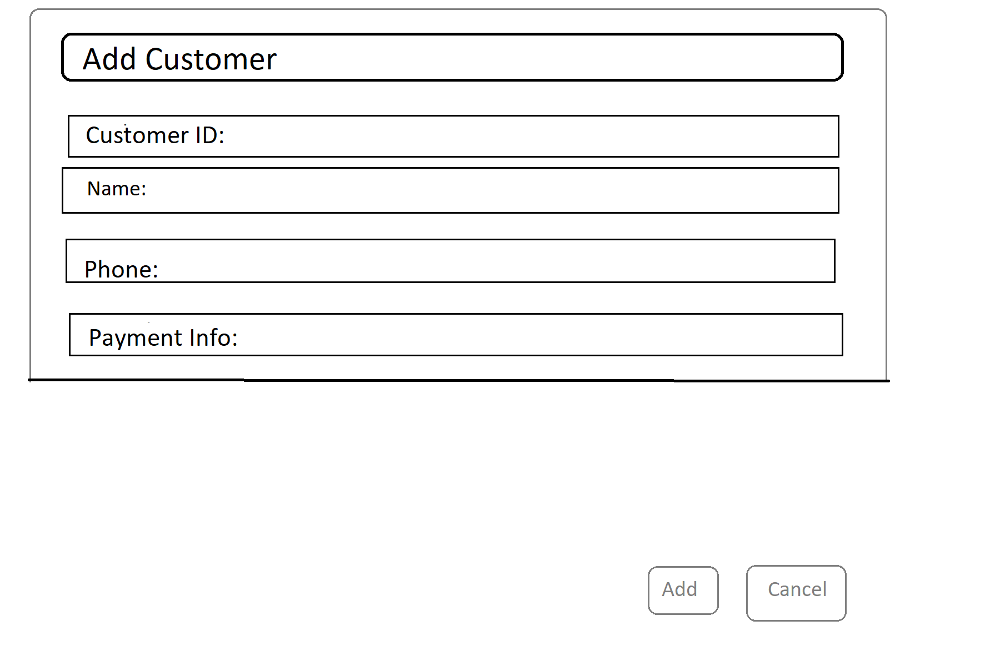
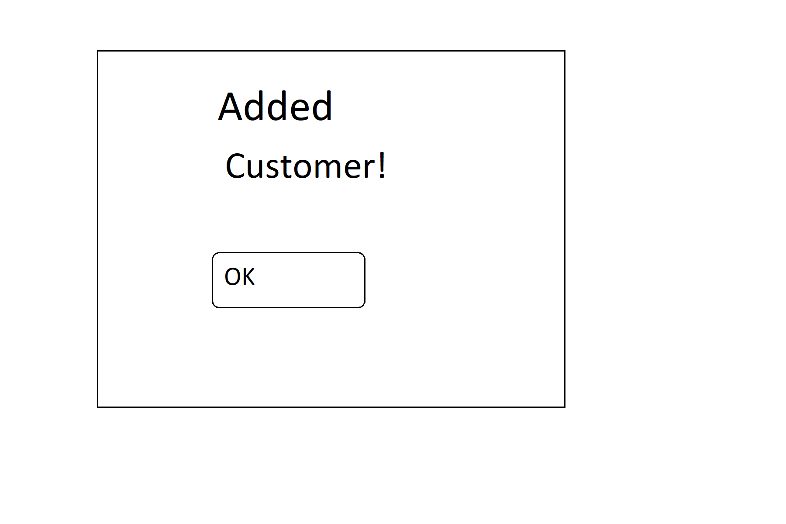

Name: Adding a new product into the system
-------------------------------------------

1. User Stories:
  * User wants to add product: User clicks add product, user fills in information, user clicks 'OK'
  * User wants to add customer: User clicks add customer, user fills in information, user clicks 'OK'
  * User wants to record purchase: User clicks add purchase, user fills in information, user clicks 'OK'

2. Write Use Cases:  
Add Product:  

|**Actor**|**System Response**|
|----------|-------------------|
|1. Choose 'Add Product'   |2. System redirects to 'Add Product Screen' |
|3. Fills in data and clicks add |4. Display 'Added Product' screen |
|5. Click 'OK' Button |6. Display 'Main'  |

Add Customer:  

|**Actor**|**System Response**|
|----------|-------------------|
|1. Choose 'Add Customer'   |2. System redirects to 'Add Customer Screen' |
|3. Fills in data and clicks add |4. Display 'Added Customer' screen |
|5. Click 'OK' Button |6. Display 'Main'  |

