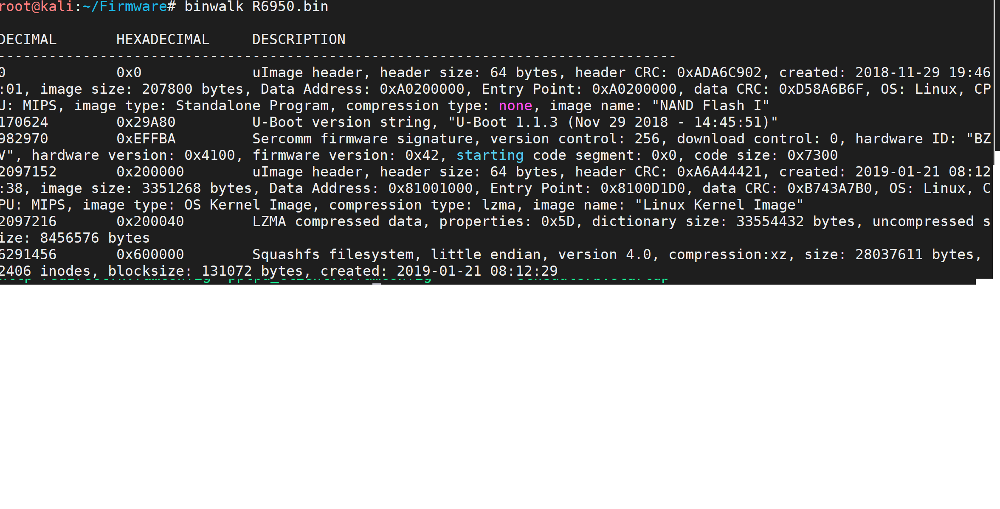
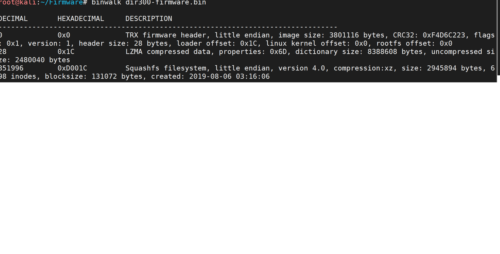
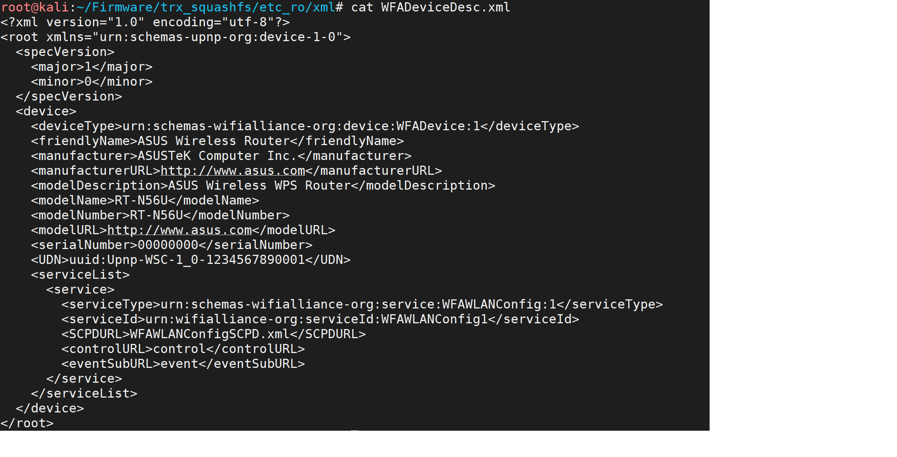
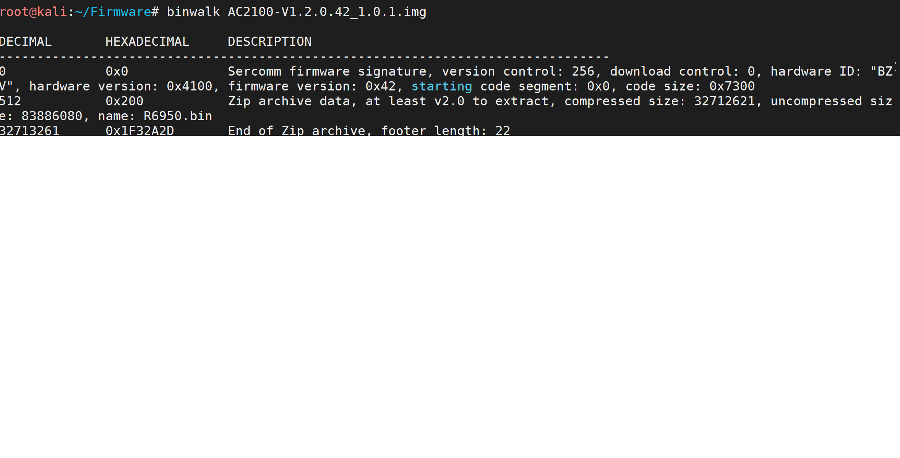
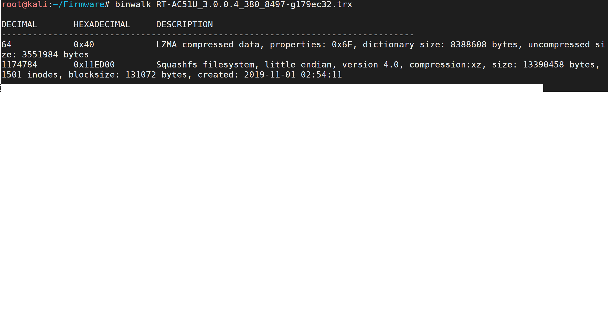
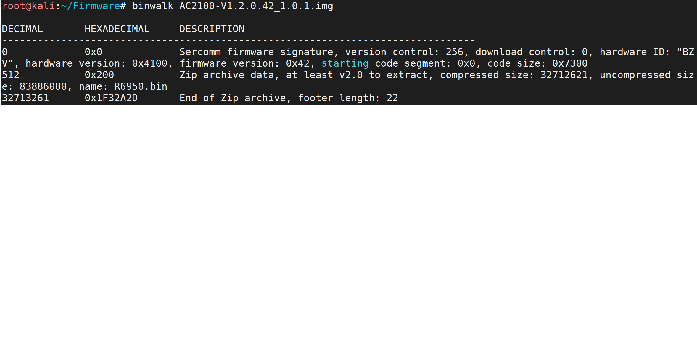
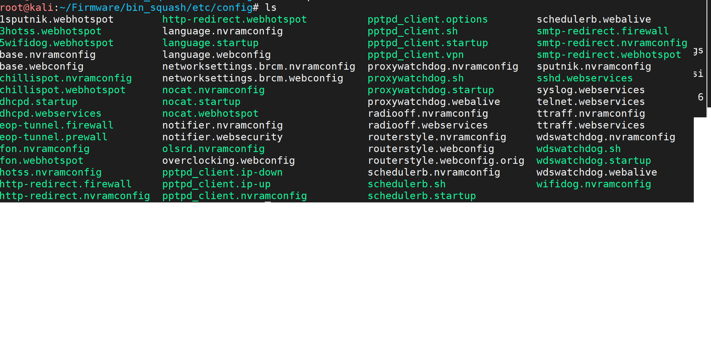
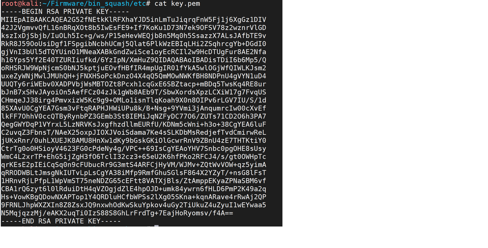

\title{COMP 5970: Firmware Homework}
\author{Alex Lewin}
\date{11/13/14}

\maketitle

# 1 Define Each of the following extensions:  
    * **.img**: This is a disc image file, which contains image data for a system. This includes all of the data from a state of a system and can be used to back up firmware.  
    * **.bin**: This is a firmware file for some models of routers.  
    * **.trx**: This is a firmware image file for some embedded systems and routers.  
# What is the difference between firmware extensions?:

At their core, firmware files hold basically the same information. The different file extensions just distinguish different organizational structures or header information.  
# What is the model number that correlates with each of the files?

   * **.img**: R6950   
      
   * **.bin**: dir300   
      
   * **.trx**: RT-N56U found in etc_ro/xml folder  
      
# What file system is being used by the file system?

   * **.img**: This uses a squash file system, found by using dd to pull out a zip file, then using binwalk after unzipping the file:  
     
     
   * **.bin**: This uses a squash file system, found using binwalk:  
     
   * **.trx**: This uses a squash file system, found using binwalk:  
     
# What compression scheme is being used by the firmware?

   * **.img**: This uses a zip for compression:  
     
   * **.bin**: This uses a zip for compression:  
     
   * **.trx**: This uses LZMA for compression:  
     
# What information in a file system can be used during a penetration test?

From the file system, attackers can gather a litany of information including firewall information, hashed passwords, private keys, and network configurations.  

When looking through the bin's squash file system, I came across the etc configurations directory that contains some useful information:  
  

I also found a private key:  
  
