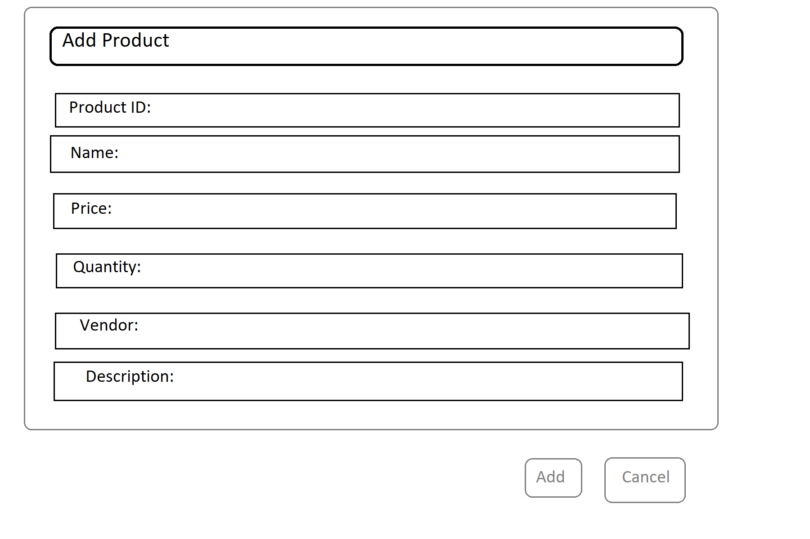
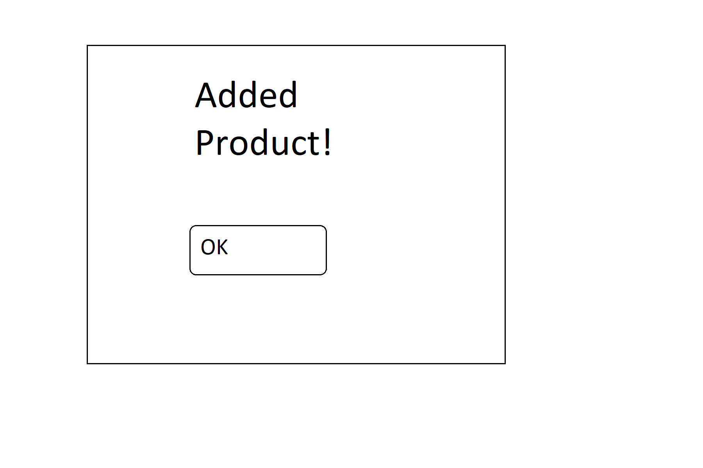
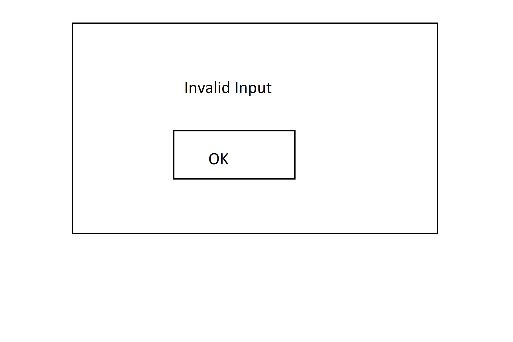

Project 2
=========
Alexander Lewin
---------------

### User Stories: 
  - As a user, I want to add a new product or update a current product in the system.  
  - As a user, I want to add a new customer or update a current customer in the system.  
  - As a user, I want to add a new purchase or update a current purchase in the system.  
 
2. Write Use Cases:  

Add Product:  

|**Actor**|**System Response**|
|----------|-------------------|
|1. Choose 'Add Product'   |2. System redirects to 'Add Product Screen' |
|3. Fills in data and clicks add |4. Display 'Added Product' screen |
|5. Click 'OK' Button |6. Display 'Main'  |

Add Product error:  

|**Actor**|**System Response**|
|----------|-------------------|
|1. Choose 'Add Product'   |2. System redirects to 'Add Product Screen' |
|3. Fills in data with error and clicks add |4. Display 'error' screen |
|5. Click 'OK' Button |6. Display 'Add Product Screen'  |

Add Customer:  

|**Actor**|**System Response**|
|----------|-------------------|
|1. Choose 'Add Customer'   |2. System redirects to 'Add Customer Screen' |
|3. Fills in data and clicks add |4. Display 'Added Customer' screen |
|5. Click 'OK' Button |6. Display 'Main'  |

Add Customer error:  

|**Actor**|**System Response**|
|----------|-------------------|
|1. Choose 'Add Customer'   |2. System redirects to 'Add Customer Screen' |
|3. Fills in data with errors and clicks add |4. Display 'error' screen |
|5. Click 'OK' Button |6. Display 'Add Customer Screen'  |

Add Purchase:  

|**Actor**|**System Response**|
|----------|-------------------|
|1. Choose 'Add Purchase'   |2. System redirects to 'Add Purchase Screen' |
|3. Fills in data and clicks add |4. Display 'Added Purchase' screen |
|5. Click 'OK' Button |6. Display 'Main'  |

Purchase error:  

|**Actor**|**System Response**|
|----------|-------------------|
|1. Choose 'Add Purchase'   |2. System redirects to 'Add Purchase Screen' |
|3. Fills in data with errors and clicks add |4. Display 'error' screen |
|5. Click 'OK' Button |6. Display 'AddPurchaseScreen'  |

