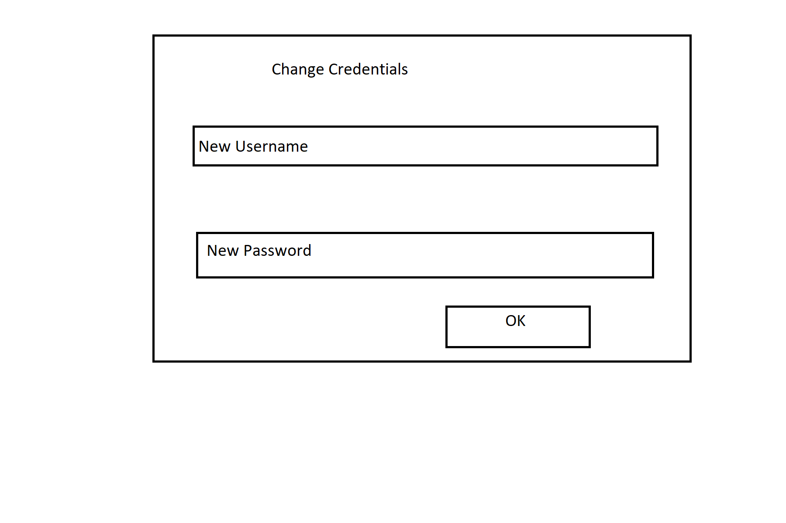

Project 1
=========
Alexander Lewin
---------------

## User Stories: 
  - As a user, I want to change my password and/or full name.  
  - As an admin, I want to add a new user into the system.  
  - As an admin, I want to update the type/class of a user into the system (e.g., from cashier to manager).  
  - As a manager, I want to add a new product or update a current product in the system.  
  - As a manager, I want to view a summary report of sales from the system.   
  - As a cashier, I want to add a new customer or update a current customer in the system.  
  - As a cashier, I want to add a new purchase or update a current purchase (only price and quantity) in the system.  
  - As a customer, I want to add a new purchase into the system.  
  - As a customer, I want to view my purchase history into the system.  
  - As a customer, I want to search for product information (based on name, price) in the system.  
 
## Write Use Cases:   

## User: 

|**Actor**|**System Response**|
|----------|-------------------|
|1. Change Credentials   |2. System redirects to 'Change Credentials Screen' |
|3. Fills in data and clicks add |4. Display 'Success' screen |
|5. Click 'OK' Button |6. Display 'Main'  |

## Manager: 

|**Actor**|**System Response**|
|----------|-------------------|
|1. Choose 'Add Product'   |2. System redirects to 'Add Product Screen' |
|3. Fills in data and clicks add |4. Display 'Added Product' screen |
|5. Click 'OK' Button |6. Display 'Main'  |

|**Actor**|**System Response**|
|----------|-------------------|
|1. Choose 'View Summary'   |2. System redirects to 'Summary' |
|3. Click 'OK' Button |4. Display 'Main'  |

## Cashier: 

|**Actor**|**System Response**|
|----------|-------------------|
|1. Choose 'Add Customer'   |2. System redirects to 'Add Customer Screen' |
|3. Fills in data with errors and clicks add |4. Display 'error' screen |
|5. Click 'OK' Button |6. Display 'Add Customer Screen'  |

|**Actor**|**System Response**|
|----------|-------------------|
|1. Choose 'Add Purchase'   |2. System redirects to 'Add Purchase Screen' |
|3. Fills in data and clicks add |4. Display 'Added Purchase' screen |
|5. Click 'OK' Button |6. Display 'Main'  |

## Customer: 

|**Actor**|**System Response**|
|----------|-------------------|
|1. Choose 'Add Purchase'   |2. System redirects to 'Add Purchase Screen' |
|3. Fills in data and clicks add |4. Display 'Added Purchase' screen |
|5. Click 'OK' Button |6. Display 'Main'  |

|**Actor**|**System Response**|
|----------|-------------------|
|1. Choose 'Add Customer'   |2. System redirects to 'Add Customer Screen' |
|3. Fills in data with errors and clicks add |4. Display 'error' screen |
|5. Click 'OK' Button |6. Display 'Add Customer Screen'  |

|**Actor**|**System Response**|
|----------|-------------------|
|1. Choose 'Search Product'   |2. System redirects to 'Search Product Screen' |
|5. Click 'OK' Button |6. Display 'Main'  |
